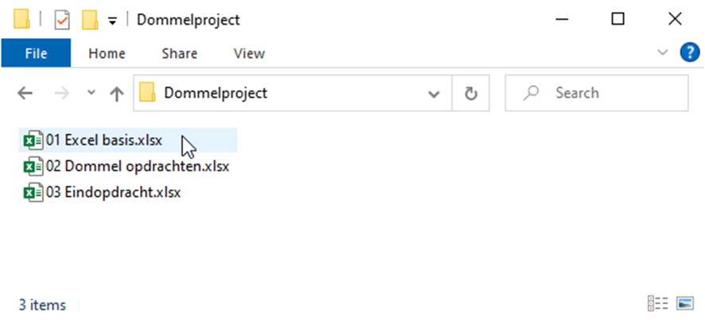
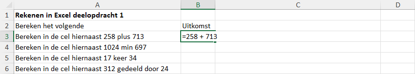
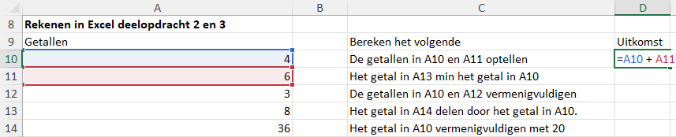
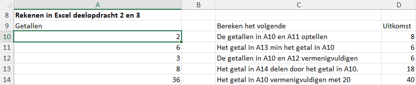
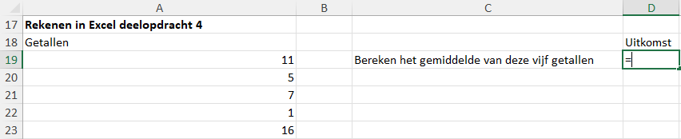
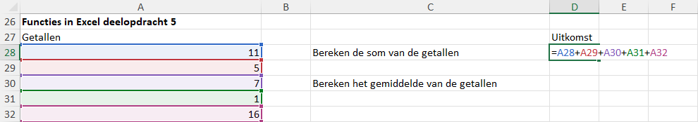
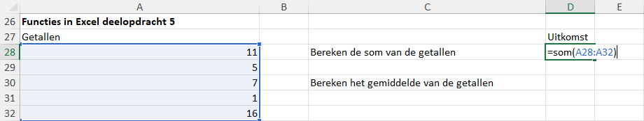
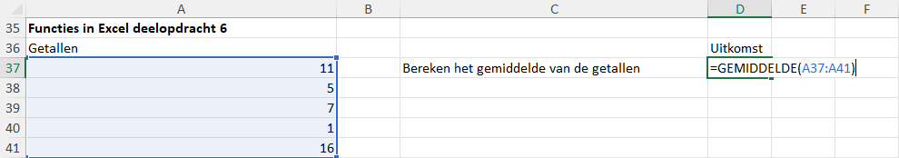
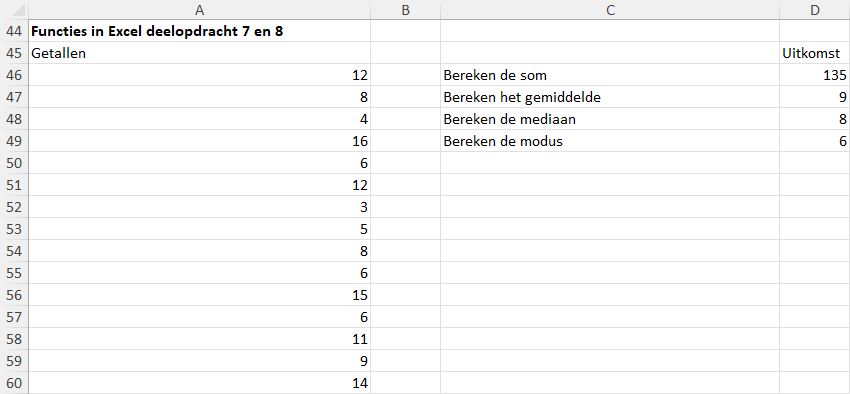
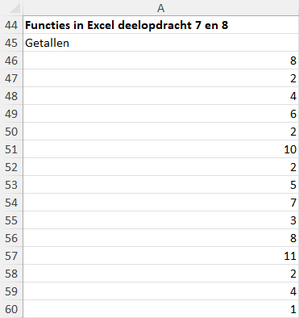

Oefenopdracht Excel basics
===========================

Bestand openen
-------------------------
Open het bestand :file:`01 Excel basis.xlsx` dat je eerder hebt gedownload en in de map :file:`Dommelproject` hebt geplaatst. Je kunt dit bestand openen door er op te dubbelklikken in de Verkenner, of door Excel te openen en vervolgens via het menu naar het bestand te navigeren (:menuselection:`Bestand` --> `Openen`).

.. dropdown:: Excel app vs Excel online
    :color: warning
    :icon: alert
    :open:
    

    Zorg ervoor dat je het bestand opent in de Excel-app op je computer, en niet in Excel online via je webbrowser. De Excel-app heeft meer functies en werkt sneller dan Excel online, wat belangrijk is voor de opdrachten die je gaat maken.

Rekenen in Excel
-------------------------
Excel is een rekenprogramma, waarmee je zeer geavanceerde berekeningen kunt maken. Maar laten we beginnen met de basisbewerkingen optellen, aftrekken, vermenigvuldigen en delen. 

Deelopdracht 1
^^^^^^^^^^^^^^^^^^^^^^^^^^
In Excel begint een berekening altijd met een is-gelijkteken ``=``. Typ in cel B3 de berekening ``=258 + 713`` en druk op Enter. Excel zal automatisch het resultaat van deze berekening tonen in cel B3.

Voer op dezelfde manier de gevraagde berekeningen uit in de cellen B4, B5 en B6. Voor optellen en aftrekken gebruik je respectievelijk de plus ``+`` en min ``-`` tekens, maar voor vermenigvuldigen gebruik je het sterretje ``*`` en voor delen de schuine streep ``/``.

.. dropdown:: Antwoorden controleren
    :color: primary
    :icon: check-circle

    .. image:: images/opdracht_01_02.png

Deelopdracht 2
^^^^^^^^^^^^^^^^^^^^^^^^^^
Rechtstreeks getallen typen in een berekening zoals bij deelopdracht 1 doe je in Excel eigenlijk nooit. In plaats daarvan verwijs je naar de cellen waarin de getallen staan. Voer in de cellen D10 t/m D14 de berekeningen uit zoals aangegeven in de cellen C10 t/m C14, en verwijs hierbij naar de cellen A10 t/m A14 in plaats van rechtstreeks getallen te typen. Dus in cel D10 typ je bijvoorbeeld ``=A10 + A11`` in plaats van ``=4 + 6``.

.. dropdown:: Antwoorden controleren
    :color: primary
    :icon: check-circle

    .. image:: images/opdracht_02_02.png

.. dropdown:: Typen of klikken?
    :color: info
    :icon: info

    Je kunt de cellen waarnaar je wilt verwijzen in een berekening ook met de muis aanklikken in plaats van ze te typen. Dus in plaats van ``=A10 + A11`` kun je ook ``=`` typen, vervolgens op cel A10 klikken, dan het plus-teken ``+`` typen, en vervolgens op cel A11 klikken. Excel zal automatisch de juiste celverwijzingen toevoegen aan je berekening.

    Tevens is het mogelijk om met de pijltjestoetsen op je toetsenbord te navigeren naar de cellen waarnaar je wilt verwijzen.

Deelopdracht 3
^^^^^^^^^^^^^^^^^^^^^^^^^^
Het voordeel van het werken met celverwijzingen zoals bij deelopdracht 2 is dat wanneer er een van de getallen in de eerste kolom verandert, de uitkomsten automatisch mee veranderen. Verander het getal in cel A10 naar het getal 2 om dit te controleren. Komen de waarden in D10 t/m D14 overeen met de figuur hieronder? Dan heb je het goed gedaan!

Deelopdracht 4
^^^^^^^^^^^^^^^^^^^^^^^^^^
Je zou nu in staat moeten zijn om met Excel het gemiddelde van vijf getallen te berekenen. Bereken in cel D19 het gemiddelde van de getallen in de cellen A19 t/m A23. Gebruik celverwijzingen en denk ook aan het gebruik van haakjes.

.. dropdown:: Antwoord controleren
    :color: primary
    :icon: check-circle

    Het gemiddelde is 8.

    .. image:: images/opdracht_04_02.png

Functies in Excel
-------------------------
Naast losse berekeningen met verschillende cellen in Excel kun je ook gebruik maken van functies in Excel. Zo kun je heel eenvoudig een rijtje getallen optellen of het gemiddelde van een rijtje berekenen. Dit gaan we in de volgende deelopdrachten ontdekken.

Deelopdracht 5
^^^^^^^^^^^^^^^^^^^^^^^^^^
De optelling van een rijtje getallen noemen we de **som** van die getallen. De som van de getallen 3, 5, en 9 is dus 3 + 5 + 9. In Excel kun je een som natuurlijk helemaal intypen...

...maar er is een snellere manier om dit te doen. In plaats van de celverwijzingen en plusjes allemaal in te typen, kun je ook gebruik maken van de functie ``SOM()``. Deze functie telt automatisch alle getallen op die je tussen de haakjes zet. Om de som van de getallen in de cellen A28 t/m A32 te berekenen, typ je in cel D28 de volgende formule: ``=SOM(A28:A32)``. De dubbele punt ``:`` tussen A28 en A32 geeft aan dat je alle cellen van A28 tot en met A32 wilt meenemen in de som. In plaats van de celverwijzingen te typen, kun je ook de cellen aanklikken en slepen met de muis om ze te selecteren.

Bereken nu zelf met de functie ``SOM()`` de gevraagde uitkomst in cel D28 en vervolgens in cel D30 het gemiddelde van de getallen, door de uitkomst in D28 te delen door het aantal getallen (5). Uiteraard zou hier hetzelfde antwoord uit moeten komen als bij deelopdracht 4.

Deelopdracht 6
^^^^^^^^^^^^^^^^^^^^^^^^^^
Bij deelopdracht 5 hebben we gezien dat de functie ``SOM()`` heel handig is om snel een rijtje getallen op te tellen. Maar er zijn nog veel meer functies in Excel die je kunnen helpen bij het maken van berekeningen. Zo is er ook een functie om het gemiddelde van een rijtje getallen te berekenen, namelijk de functie ``GEMIDDELDE()``. 

Bereken in cel D37 het gemiddelde van de getallen in de cellen A37 t/m A41 met behulp van deze functie. Kom je op hetzelfde antwoord uit als bij deelopdracht 4 en 5? Dan heb je het goed gedaan!

Deelopdracht 7
^^^^^^^^^^^^^^^^^^^^^^^^^^
Bij wiskunde heb je wellicht al iets geleerd over de centrummaten *gemiddelde*, *mediaan* en *modus* (zo niet, dan kun je `hier <https://www.slimleren.nl/onderwerpen/rekenen/12.252/centrummaten:-gemiddelde,-mediaan-en-modus>`_ informatie vinden). Voor elk van deze centrummaten heeft Excel een functie: ``GEMIDDELDE()``, ``MEDIAAN()`` en ``MODUS()`` (of ``MODUS.ENKELV()``).

Bereken in de cellen D46 t/m D49 de som, gemiddelde, mediaan en modus van de getallen in de cellen A46 t/m A60. Als het goed is, krijg je de onderstaande uitkomsten.

Deelopdracht 8
^^^^^^^^^^^^^^^^^^^^^^^^^^
Wijzig nu de getallen in A46 t/m A60 als volgt:

Als je het goed hebt gedaan, zijn de uitkomsten in D46 t/m D49 meeveranderd.

.. dropdown:: Antwoorden controleren
    :color: primary
    :icon: check-circle

    .. image:: images/opdracht_08_02.png

.. dropdown:: Handig getallen invoeren
    :color: info
    :icon: info

    Bij deelopdracht 8 moest je een reeks waarden invoeren in Excel. Daarvoor kun je het beste gebruik maken van het numerieke gedeelte rechts op je toetsenbord.

    .. figure:: images/keyboard_numerical.png
       :align: center

    Je vindt hier de getallen 0 t/m 9, maar ook de plus ``+``, min ``-``, sterretje ``*`` en schuine streep ``/`` tekens die je nodig hebt voor het invoeren van berekeningen in Excel. Zorg ervoor dat je Num Lock aan hebt staan, anders werken deze toetsen niet.

    Als je op :kbd:`Enter` drukt nadat je een getal hebt ingevoerd, springt de selectie automatisch naar de volgende cel. Soms is dat echter naar rechts, terwijl je juist naar beneden wilt. Dit kun je instellen via :menuselection:`Bestand --> Opties --> Geavanceerd --> Selectie verplaatsen nadat ENTER is ingedrukt` en vervolgens de gewenste richting selecteren.

    .. figure:: images/excel_selectie_verplaatsen.png
       :align: center

Dit is het einde van de eerste oefenopdracht. In de volgende oefenopdracht *Stroomsnelheid* ga je aan de slag met het invoeren van data en het maken van diagrammen in Excel.