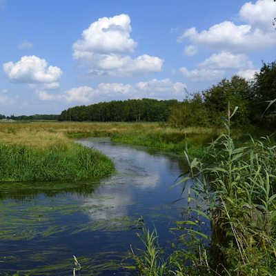
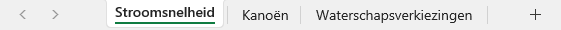
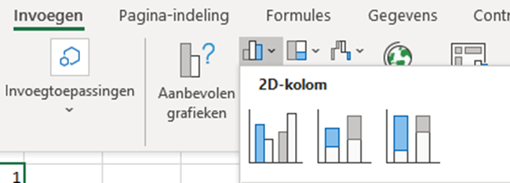
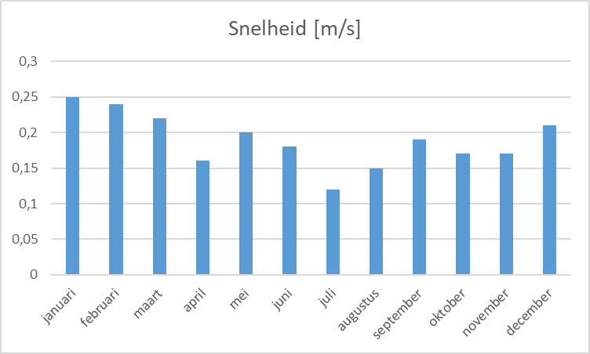
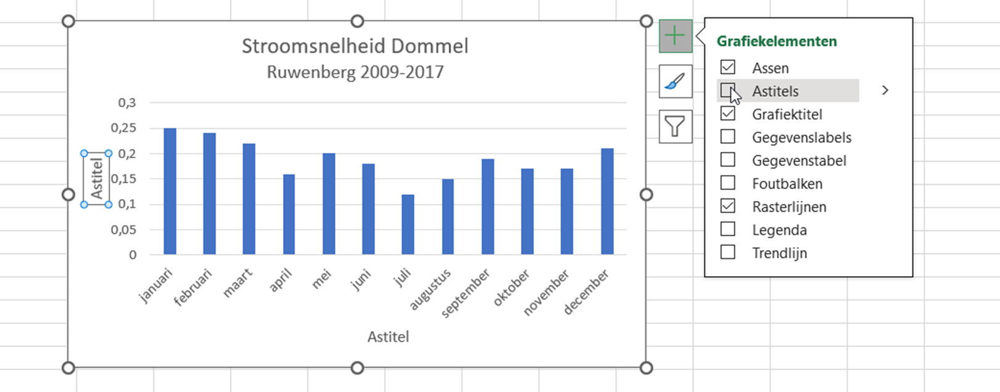
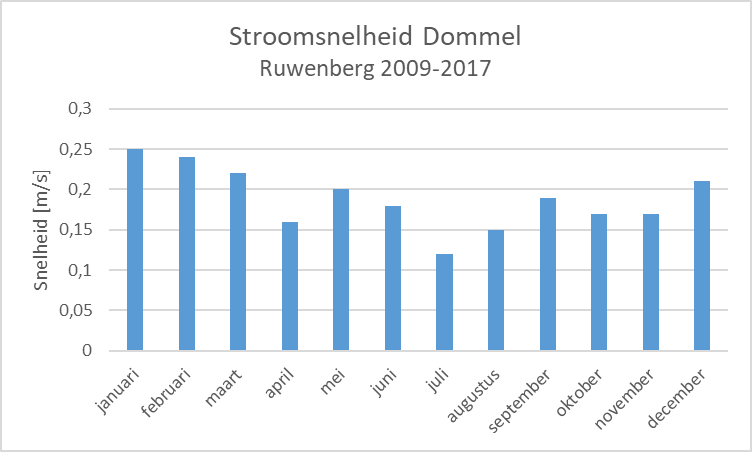
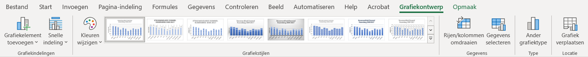

Oefenopdracht Stroomsnelheid
=======================================

      
Nu je basisberekeningen in Excel onder de knie hebt, kunnen we ons richten op de Dommel. Deze beek (en verder stroomafwaarts een kleine rivier) begint in België ten zuiden van Peer en komt bij Borkel en Schaft Nederland binnen. In 's-Hertogenbosch komen de rivier de Aa en de Dommel samen en vormen de Dieze, die uiteindelijk uitmondt in de Maas.

Op de `website van Natuurmonumenten <https://www.natuurmonumenten.nl/natuurgebieden/dommeldal/bezienswaardigheden/over-de-dommel>`_  wordt beweerd dat het water in de  Dommel gemiddeld met 0,5 à 1 meter per seconde stroomt. In deze oefenopdracht ga je onderzoek doen naar de stroomsnelheid van de Dommel bij Sint-Michielsgestel. Daarbij maak je kennis met enkele basisvaardigheden in Excel en je leert hoe je een staafdiagram invoegt in een werkblad.

Werkbladen
---------------------------------------
Je kunt het bestand :file:`01 Excel basis.xlsx`` uit de vorige opdracht sluiten. Open nu het bestand :file:`02 Dommel opdrachten.xlsx`. Een bestand wordt in Excel een *werkmap* genoemd. In die werkmap bevinden zich *werkbladen*. Onderin je scherm zie je de tabbladen staan waarmee je tussen de werkbladen kunt schakelen. Zorg dat voor deze opdracht werkblad ``Stroomsnelheid`` actief is.

Data invoeren
---------------------------------------
Bij de fietsbrug bij de Ruwenberg in Sint-Michielsgestel bevindt zich een meetpunt voor de stroomsnelheid van de Dommel. Van de periode 2009-2017 zijn de volgende maandgemiddelden (in meter per seconde) berekend:

.. list-table:: Gemiddelde stroomsnelheid van de Dommel bij Sint-Michielsgestel 2009-2017
   :stub-columns: 1

   * - Maand
     - jan
     - feb
     - mrt
     - apr
     - mei
     - jun
     - jul
     - aug
     - sep
     - okt
     - nov
     - dec
   * - Stroomsnelheid (m/s)
     - 0,25
     - 0,24
     - 0,22
     - 0,16
     - 0,20
     - 0,18
     - 0,12
     - 0,15
     - 0,19
     - 0,17
     - 0,17
     - 0,21

Je ziet dat in Excel de maanden al zijn ingevuld, maar de tabel staat verticaal in plaats van horizontaal zoals hierboven. Dat is gebruikelijk in Excel en als je je aan dit gebruik houdt, is het invoegen van diagrammen later gemakkelijker.

Voer nu zelf de gemiddelde snelheden uit de bovenstaande tabel in in de cellen B6 t/m B17 in Excel.

.. dropdown:: Handig getallen invoeren
   :open:
   :color: info
   :icon: info

   .. image:: images/keyboard_numerical.png
      :align: right
      :width: 100px

   Gebruik voor het invoeren van getallen in Excel het numerieke gedeelte van je toetsenbord (zorg dat Numlock aan staat). Van de punt maakt Excel automatisch een komma en als je op Enter drukt, ga je naar de volgende cel. Gaat de celselectie naar rechts in plaats van naar beneden wanneer je op Enter drukt? Dat kun je aanpassen via :menuselection:`Bestand --> Opties --> Geavanceerd`.

   .. image:: images/opties_selectie_verplaatsen.png
      :align: center
      :class: border
      :width: 400px

Diagram invoegen
---------------------------------------
Excel kan allerlei soorten diagrammen maken bij de data die je invoert. Voor deze opdracht ga je een *staafdiagram* invoegen.

* Selecteer de cellen A5 t/m B17. 
* Ga in de menubalk naar Invoegen en klik op het icoontje van het staafdiagram
* Kies het grafiektype 2D-kolom en daarbij het eerste subtype (de eerste optie). Zie de afbeelding hieronder.

Je ziet dat Excel behoorlijk intelligent is en de juiste informatie op de horizontale en verticale assen heeft gezet. Er is zelfs een titel boven het diagram geplaatst.

Er valt echter nog wel iets te verbeteren. Eigenlijk is de titel boven het diagram meer geschikt als astitel bij de verticale as. Maak daarom de volgende aanpassingen:

* Wijzig de titel in *Stroomsnelheid Dommel* en op een nieuwe regel eronder *Ruwenberg 2009-2017* (eventueel in een wat kleiner lettertype).
* Selecteer het diagram en klik op het ➕ knopje dat rechtsboven het diagram verschijnt. Vink :guilabel:`Astitels` aan:

* Zet vervolgens bij de verticale as de titel *Snelheid [m/s]*. Bij de horizontale as kun je het astitelvakje verwijderen, want de maanden spreken voor zich.

Als het goed is, heb je nu het onderstaande diagram.

Je kunt het diagram naar eigen inzicht nog verder verfraaien. Ga in de menubalk maar eens naar :guilabel:`Grafiekontwerp` (dat is alleen zichtbaar als je het diagram hebt geselecteerd). Je ziet dan opties om onder andere de kleur te veranderen en om een andere grafiekstijl te kiezen, bijvoorbeeld met schaduwen. Experimenteer hiermee.

Dit is het einde van de oefenopdracht *Stroomsnelheid*. Ga door met de volgende opdracht: *Kanoën*.