Oefenopdracht Kanoën
=======================================

De Dommel is een populaire beek onder kanovaarders. Om de natuur in en om het water te beschermen hanteert het waterschap normen voor het maximale aantal kano's dat per dag op een bepaald gedeelte van de Dommel mag varen. In deze opdracht verwerken we tellingen in Excel in een frequentietabel en maken daar een histogram bij.

Werkblad
---------------------------------------
Let op: voor deze opdracht blijf je werken in het bestand :file:`02 Dommel opdrachten.xlsx`. Zorg dat het werkblad ``Kanoën`` actief is.

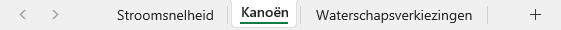

Kolombreedte aanpassen
---------------------------------------
Kasper en Nora lopen stage bij het waterschap en hebben een dag van 8.00 uur tot 20.00 uur bij de brug bij de Ruwenberg gezeten om te tellen hoeveel kano's voorbij voeren. Ze werkten daarbij met blokken van een kwartier. In werkblad ``Kanoën`` vind je de resultaten.

Je ziet dat de tijdblokken niet helemaal zichtbaar zijn, doordat kolom A eigenlijk te smal is. Pas dit aan door met de muiscursor op het verticale streepje tussen de kolomtitels A en B te gaan staan. De cursor verandert dan in een dubbele pijl. Sleep het streepje naar rechts om kolom A breder te maken.

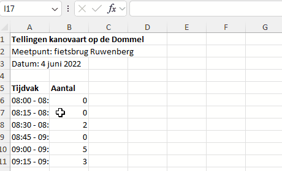

.. dropdown:: Kolom automatisch passend maken
   :color: info
   :icon: info

   Je kunt een kolom automatisch passend maken door te *dubbelklikken* op het streepje tussen de kolomtitels. Excel kijkt dan naar alle cellen in de kolom en past de breedte aan op de langste inhoud. In dit geval is dat de titel in cel A1. Probeer het maar eens.
   
   Bij deze opdracht is het beter om handmatig de kolombreedte in te stellen door te slepen, want de titel blijft toch al goed zichtbaar zolang cel B1 leeg is.

Frequentietabel
---------------------------------------
Nu gaan we de tellingen verwerken in een frequentietabel. Daarvoor moeten we tellen hoe vaak elke waarneming (in dit geval elk aantal kano's per kwartier) voorkomt. Beter gezegd: we moeten Excel laten tellen hoe vaak elke waarneming voorkomt. Ga als volgt te werk:

* Typ in cel E5 het woord *Aantal*.
* Typ in cel F5 het woord *Frequentie*.
* Typ in cel E6 het getal 0 (dat is namelijk de laagste waarneming).
* Typ in cel E7 het getal 1.

Nu zou je in cel E8 t/m E13 de getallen 2 t/m 7 kunnen typen, maar voor de wat luiere mensen onder ons is er een handig hulpmiddel in Excel: de vulgreep.

De vulgreep
-------------------------
Selecteer de cellen E6 en E7 (waarin je zojuist de getallen 0 en 1 hebt geplaatst). Om de twee cellen staat nu een groene rand, met rechtsonder een blokje. Dat blokje heet de vulgreep.

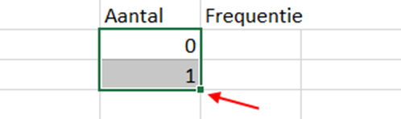

Sleep de vulgreep omlaag naar cel E13 en je zult zien dat Excel begrijpt dat je automatisch wilt doornummeren.

.. dropdown:: Slimme vulgreep
   :color: info
   :icon: info

   Wanneer je de vulgreep gebruikt, kijkt Excel of het een verband ziet tussen de geselecteerde cellen, en probeert dat verband voort te zetten. Kijk maar eens wat er gebeurt als je in E7 het getal 2 typt in plaats van 1 en vervolgens de vulgreep gebruikt nadat je E6 en E7 hebt geselecteerd.
   
   Je kunt ook één cel selecteren en de vulgreep gebruiken. In dat geval wordt de inhoud van de cel gekopieerd.

Als het goed is, heb je nu de cellen E5 t/m F13 als volgt gevuld:

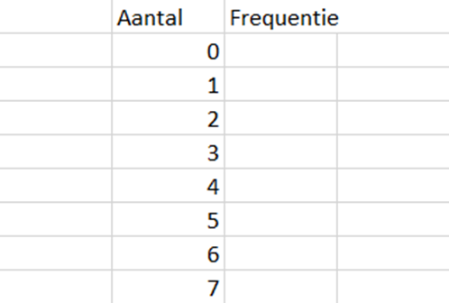

Voor het vullen van de *Frequentie* kolom gaan we een Excel formule gebruiken. Je zou natuurlijk ook zelf de frequenties kunnen tellen en intypen, maar het is juist de bedoeling van Excel om dat 'domme werk' van je over te nemen.

* Selecteer cel F6.
* Ga in de menubalk naar :menuselection:`Formules --> Functie invoegen`.

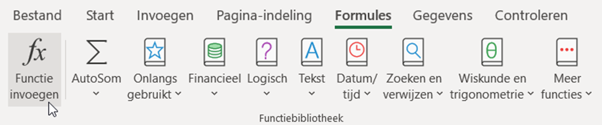

* Er verschijnt een dialoogvenster. Typ bij 'Zoek een functie' het woord ``aantal`` en klik op :guilabel:`Zoeken`.

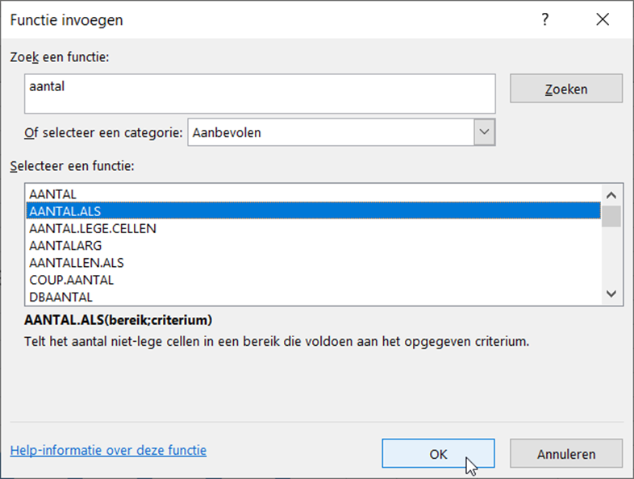

   Je ziet een lijst functies die te maken hebben met aantallen bepalen. Wij hebben de functie ``AANTAL.ALS`` nodig. Je ziet de uitleg die Excel hierbij geeft:

   .. card:: AANTAL.ALS(bereik; criterium)
      :text-align: left

      Telt het aantal niet-lege cellen in een bereik die voldoen aan het opgegeven criterium.

We moeten aan deze functie dus twee dingen meegeven:

1. Een *bereik* van cellen waarin Excel gaat zoeken.
2. Een *criterium* (voorwaarde) waaraan de cellen moeten voldoen om meegeteld te worden in het aantal.

* Klik op :guilabel:`OK`. Nu verschijnt een venster waarin je precies die twee dingen kunt invullen. Als het goed is, knippert de cursor in het veld :guilabel:`Bereik`. Zo niet, klik dan in het veld om het te activeren. Gebruik vervolgens de muis om in het werkblad de cellen B6 t/m B53 te selecteren. Je ziet dat Excel bij Bereik dan B6:B53 plaatst. Klik daarna in het veld :guilabel:`Criterium`, zodat er een cursor gaat knipperen en selecteer in het werkblad cel E6.
 
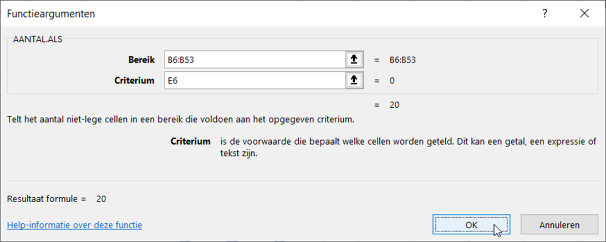

* Klik op :guilabel:`OK` om de formule in cel F6 te plaatsen. Verschijnt het getal 20? Dan heb je het goed gedaan.

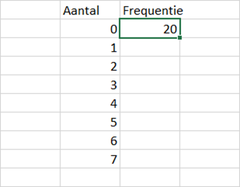

De functie ``AANTAL.ALS()`` heeft alle cellen in het bereik B6:B53 geteld waarvan de inhoud overeenkomt met de inhoud van cel E6, waarin het getal 0 staat. Op deze manier hebben we dus de *frequentie* van 0 geteld.

Wanneer cel F6 is geselecteerd zie je boven in beeld de formule staan:

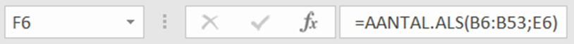

.. dropdown:: Automatische herberekening
   :color: info
   :icon: info

   Wanneer er iets verandert in het werkblad, worden de formules automatisch herberekend. Wijzig de 0 in cel B6 maar eens in een 1 en druk op Enter. Je ziet dat de waarde in F6 van 20 naar 19 is gegaan. Maak je wijziging ongedaan met de toetscombinatie :kbd:`Ctrl+Z`.

.. dropdown:: Formule direct in de cel typen
   :color: info
   :icon: info

   Als je de naam van een formule weet, kun je hem ook meteen in een cel typen. Je moet dan wel eerst een = teken typen, zodat Excel weet dat je een formule gebruikt. Typ in cel F7 maar eens =aantal. Je ziet dan een lijst functies verschijnen en kunt ``AANTAL.ALS()`` direct selecteren. 

Formules kopiëren
-------------------------

Zojuist heb je in cel F6 de formule ``AANTAL.ALS(B6:B53;E6)`` geplaatst om het aantal cellen in het bereik B6 t/m B53 te tellen dat een waarde bevat die gelijk is aan de waarde in E6, te weten het getal 0. In cel F6 verscheen het getal 20, dus blijkbaar heeft Excel 20 nullen geteld.

In de cellen F7 t/m F13 moet een soortgelijke formule komen. In F7 moet het aantal enen worden geteld met ``AANTAL.ALS(B6:B53;E7)``, in F8 het aantal tweeën met ``AANTAL.ALS(B6:B53;E8)``, enzovoort. Je zou dit handmatig kunnen doen, maar het gaat sneller als je de formule uit F6 kopieert naar de cellen eronder. Daarbij zit echter wel een addertje onder het gras!

* Klik op cel F6 en sleep de vulgreep naar beneden om de formule te kopiëren naar de cellen F7 t/m F13:

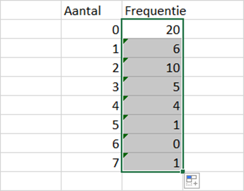

Voilà, de formule uit F6 is gekopieerd en de frequenties van alle waarnemingen zijn geteld. Echter, als je goed kijkt, zie je dat er iets niet klopt! De frequentie van de waarneming 5 is 1 (in cel F11). Maar in het bereik B6:B53 komen 2 vijven voor (in cellen B10 en B13). Kan Excel niet tellen?

Wat hier misgaat kun je goed zien door te *dubbelklikken* op cel F6. Je ziet dan dat Excel met kleurtjes aangeeft welke cellen gebruikt worden in de formule:

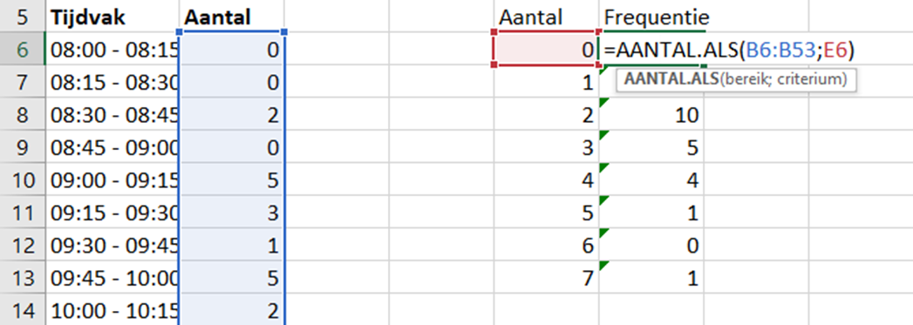

Dubbelklik nu op cel F7. Wat valt je op?

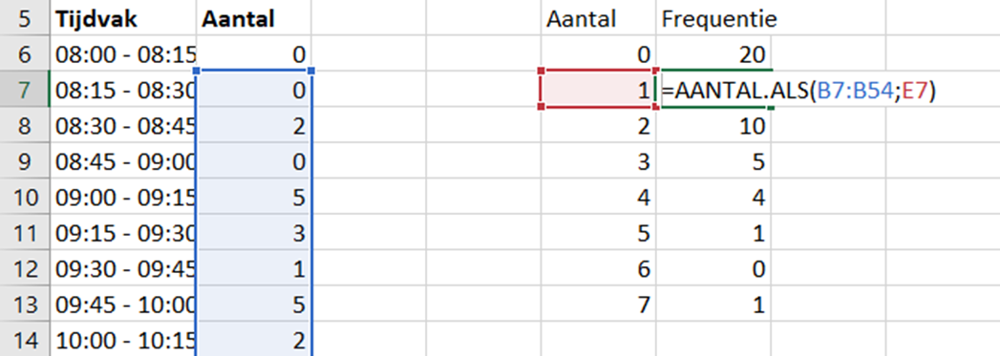

Excel heeft de formule uit F6 niet alleen gekopieerd, maar ook de cellen die de formule gebruikt opgeschoven. Cel E6 is cel E7 geworden, en dat is precies wat we willen. Maar bereik B6:B53 is nu bereik B7:B54 geworden en dat willen we niet! Als je dubbelklikt in cel F11, zie je dat ``AANTAL.ALS`` de vijven telt in het bereik B11:B58, waardoor de 5 in B10 wordt gemist.

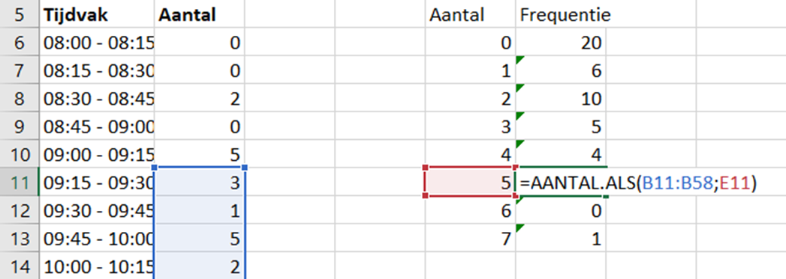

.. _celverwijzingen_vergrendelen:

Uiteraard is er een oplossing voor dit probleem. Je kunt in een formule cellen *vergrendelen* zodat ze niet verschuiven bij kopiëren. Dit doe je als volgt:

* Dubbelklik op cel F6 om de formule te bewerken.
* Klik in de formule op B6, zodat de cursor knippert tussen de B en de 6:
  
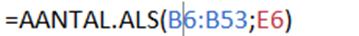

* Druk vervolgens op je toetsenbord op de toets :kbd:`F4`. Je ziet dollartekens verschijnen voor de B en de 6:

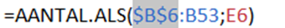

* Klik in de formule op B53, zodat de cursor knippert tussen de B en de 53. Druk weer op de F4-toets om de dollartekens te maken.

Als je het goed hebt gedaan, staat in F6 nu ``=AANTAL.ALS($B$6:$B$53;E6)``. De dollartekens geven aan dat het bereik B6:B53 is vergrendeld.

* Kopieer nu met de vulgreep opnieuw de inhoud van F6 naar de cellen F7 t/m F13 om de juist frequentietabel te krijgen:

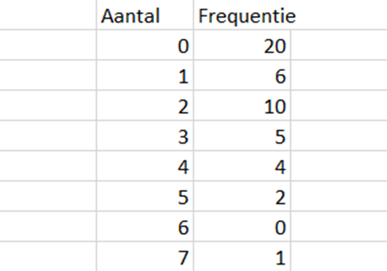

Je ziet dat nu ook de groene driehoekjes in de linkerbovenhoeken van de cellen zijn verdwenen. Die verschenen bij de eerste keer kopiëren als waarschuwing omdat Excel al het vermoeden had dat er iets niet klopte.

.. dropdown:: Ctrl+C en Ctrl+V
   :color: info
   :icon: info

   In Excel kun je ook kopiëren en plakken met :kbd:`Ctrl+C` en :kbd:`Ctrl+V` zoals in andere Windows programma's. In dit geval zou je dan cel F6 selecteren, :kbd:`Ctrl+C` indrukken, daarna F7 t/m F13 selecteren en :kbd:`Ctrl+V` indrukken.

.. dropdown:: Geavanceerde vergrendeling
   :color: info
   :icon: info

   Voor gevorderden. Bij het vergrendelen van cellen kun je ook meerdere keren op de F4-toets drukken. Op die manier kun je óf alleen de kolomletter óf alleen het rijnummer óf beide vergrendelen. Dit kan soms van pas komen, maar heb je vandaag niet nodig.

Histogram invoegen
---------------------------------------
Een histogram is een staafdiagram bij een frequentietabel, waarbij de staven tegen elkaar aan staan. 
   
* Selecteer de cellen E5 t/m F13 en voeg een staafdiagram in op dezelfde manier als in paragraaf 3.3.

Nu gebeurt er iets wat niet de bedoeling is. Excel maakt een staafdiagram met twee reeksen. Blijkbaar snapt het programma niet dat wij de waarnemingen op de horizontale as willen hebben en de frequentie op de verticale as. Dat moeten we dus zelf instellen.

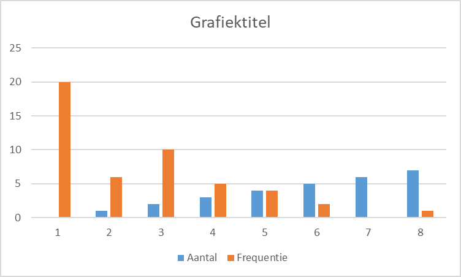

* Klik met de rechtermuisknop op het diagram en kies :guilabel:`Gegevens selecteren`. Je krijgt dan het volgende te zien:

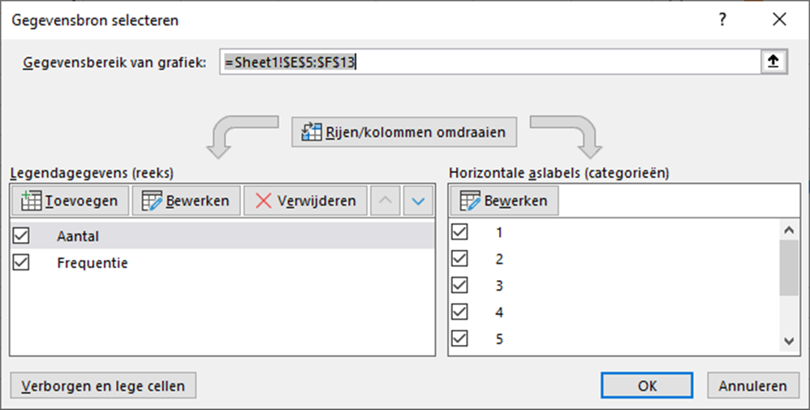

Links zie je de twee reeksen staan die Excel in het diagram toont. Rechts staan de horizontale aslabels 1 t/m 8 die Excel zelf heeft bedacht. Pas het volgende aan:

* Verwijder de reeks ``Aantal`` met de knop :guilabel:`Verwijderen`.
* Klik bij :guilabel:`Horizontale aslabels` op de knop :guilabel:`Bewerken`. Selecteer vervolgens met de muis de cellen E6 t/m E13, zodat de waarnemingen op de horizontale as terechtkomen. Klik op :guilabel:`OK` om te bevestigen.

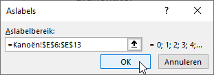

Nu zou je het volgende diagram moeten zien:

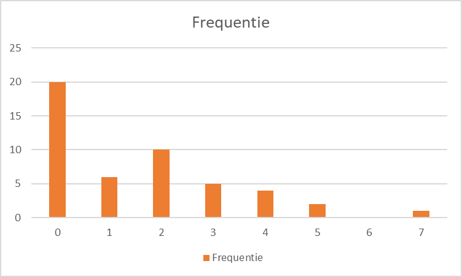

We zijn bijna klaar. De titels kloppen nog niet en de staven staan nog niet tegen elkaar aan. Doe daarom het volgende:

* Wijzig de titel van het diagram, zoals je eerder hebt geleerd.
* Verwijder de legenda die nu onder het diagram staat.
* Plaats titels bij de assen.

Zet vervolgens de staven tegen elkaar op de volgende manier:

* Klik met de rechtermuisknop in het diagram op een van de staven en kies :guilabel:`Gegevensreeks opmaken`.
* Stel Breedte tussenruimte in op 0%. Je kunt Overlapping van reeks ook op 0% zetten:

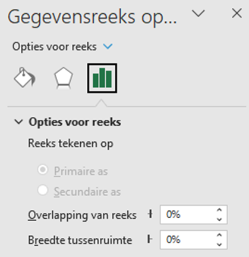

* Klik in het rechterpaneel (waar je zojuist de Breedte tussenruimte instelde) op de knop met het verfbusje en kies bij Rand voor Ononderbroken lijn. Geef die een mooie kleur teneinde de staven iets duidelijker te maken.

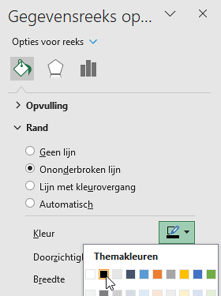

Als je alles goed hebt gedaan, is je histogram nu klaar en ziet er ongeveer zo uit:

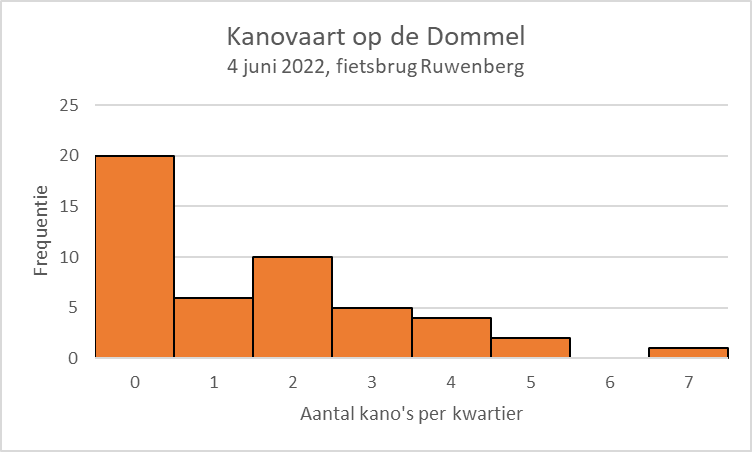

Dit is het einde van de opdracht *Kanoën*. Ga door met de volgende opdracht: *Waterschapsverkiezingen*.