Oefenopdracht Waterschapsverkiezingen
=======================================

Op 15 maart 2023 waren er waterschapsverkiezingen. In deze opdracht verwerken we de uitslag voor Waterschap de Dommel in Excel en maken een cirkeldiagram.

Percentages berekenen
-------------------------

In werkblad ``Opdracht 4`` staat de uitslag van de waterschapsverkiezingen van 2023 en ter vergelijking ook die van 2019 voor Waterschap de Dommel. Om iets over het verschil tussen 2019 en 2023 te kunnen zeggen, is het nodig dat we het aantal stemmen omrekenen naar percentages. Zoals je weet bereken je een percentage met de formule:

.. math:: percentage = \frac{deel}{geheel} \times 100\%

We hebben dus het *geheel* nodig. Dat is het totale aantal geldige stemmen. Uiteraard kan Excel dat voor je berekenen:

* Typ in cel A19 het woord Totaal.
* Typ in cel B19 ``=SOM(`` (het haakje openen is belangrijk) en selecteer vervolgens met de muis de cellen B6 t/m B18. Als je daarna op Enter drukt, staat in B19 de formule ``=SOM(B6:B18)`` die alle waarden in B6 t/m B18 optelt.
* Zet op dezelfde manier in cel C19 de formule die alle geldige stemmen in 2019 optelt (of nog sneller: kopieer de formule uit B19 naar C19).
* Selecteer de cellen A19 t/m C19 en maak de inhoud dikgedrukt.

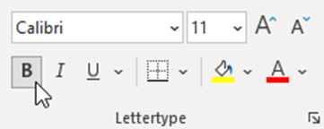

* Selecteer de cellen B19 en C19 en centreer de inhoud, zodat de getallen in het midden worden uitgelijnd in plaats van rechts.

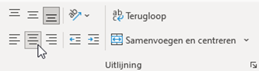

Nu kunnen we de percentages van de partijen gaan berekenen:

* Typ in cel D5 de tekst *Percentage 2023* en in cel E5 *Percentage 2019*.
* In cel D6 moet de formule ``=B6/B19`` komen. We willen immers :math:`\frac{deel}{geheel}` doen.

Als je dit goed hebt gedaan, staat in D6 nu het getal 0,227528426. Dat is dus ongeveer 22,7% voor de partij Water Natuurlijk. Je vraagt je misschien af waarom we in D6 niet de formule ``=B6/B19*100`` hebben gezet, want de formule voor een percentage is toch :math:`\frac{deel}{geheel} \times 100\%`. Daarover straks meer.

In de cellen onder D6 moeten de percentages van de andere partijen komen. Kopieer de formule uit D6 (bijvoorbeeld met de vulgreep) naar beneden, en zie dat er foutmeldingen verschijnen:

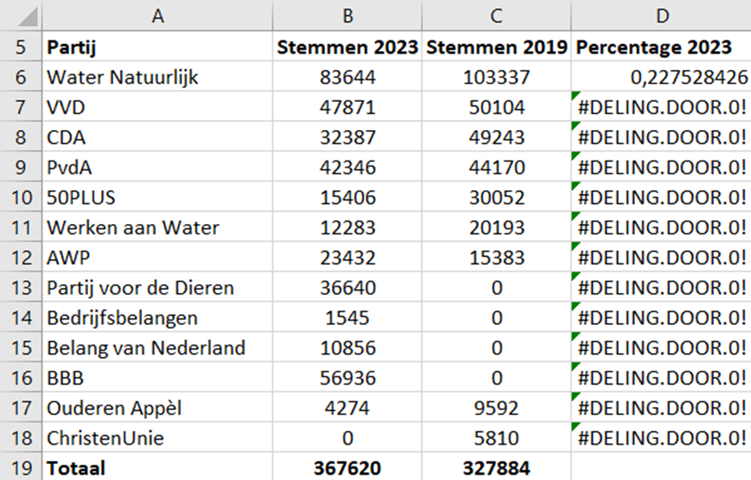

Als je de foutmelding niet goed kunt lezen, moet je de kolombreedte aanpassen. Dubbelklik op het scheidingsstreepje tussen de kolomkoppen D en E om dat automatisch te doen.

Wanneer je dubbelklikt op cel D7, zie je wat er misgaat. Bij het kopiëren van de formule zijn de celverwijzingen mee opgeschoven. Los dit op door in de formule in cel D6 de verwijzing naar B19 te vergrendelen met de :kbd:`F4`-toets (zie ook de :ref:`opdracht Kanoën <cellen_vergrendelen>`) en daarna opnieuw te kopiëren.

Getalnotatie
-------------------------

Zoals eerder opgemerkt, staan in kolom D nog geen percentages, want we hebben de formule :math:`\frac{deel}{geheel}` gebruikt in plaats van :math:`\frac{deel}{geheel} \times 100\%`.

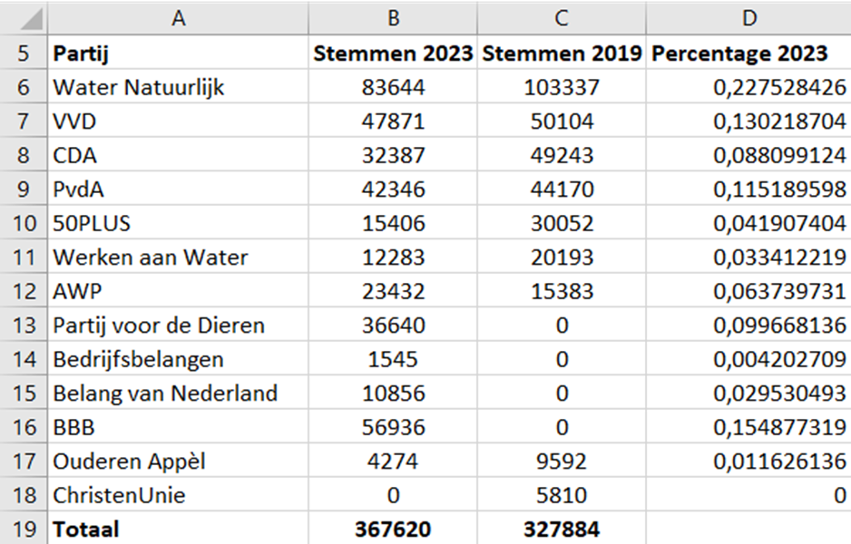

Uiteraard hadden we de vermenigvuldiging met 100 in de formule kunnen verwerken, maar Excel heeft een betere manier:

* Selecteer de cellen D6 t/m D18.
* Klik in het lint (die brede knoppenbalk bovenin beeld) op de procentknop.

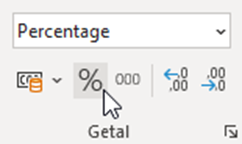

Excel toont de waarden in kolom D nu als percentages afgerond op gehelen. Wil je afronden op 1 decimaal, dan kan dat met de 'meer decimalen' knop:
   
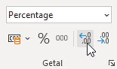

Probeer nu zelf in kolom E de percentages van 2019 te berekenen.

.. dropdown:: Rechtermuisknop
   :color: info
   :icon: info

   In Excel bevinden veel handige functies zich ook onder de rechtermuisknop. Selecteer de cellen D6 t/m D18 en klik daarna met de rechtermuisknop in je selectie. Kies vervolgens voor :guilabel:`Celeigenschappen`. Je kunt dan de getalnotatie instellen en nog veel meer.

   .. figure:: images/celeigenschappen.png
      :figwidth: 600px
      :align: center

Je zou nu de volgende tabel moeten hebben:

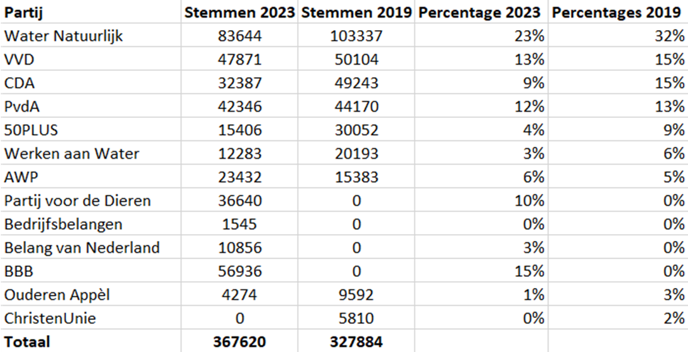

Procentuele toe- of afname
---------------------------------------
Bij verkiezingsuitslagen wordt altijd aangegeven of een partij meer of minder stemmen heeft gekregen dan de vorige keer. Dat gaan wij natuurlijk ook doen:

* Typ in cel F5 het woord *Verschil*.
* Zet in cel F6 de formule ``=D6-E6``.
* Kopieer deze formule naar de cellen F7 t/m F18.

Het resultaat zou er zo moeten uitzien:

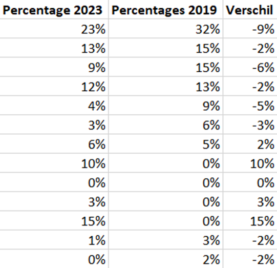

Maar wacht eens even, procentuele verandering berekenen we toch op een andere manier? De formule die je hebt geleerd is

.. math:: \text{procentuele verandering} = \frac{\text{NIEUW} - \text{OUD}}{\text{OUD}} \times 100\%

Wat zijn dan de percentages die nu in kolom F staan? Dat zijn de *absolute* verschillen tussen de percentages in 2019 en 2023, niet de *relatieve*. Dit moeten we duidelijk aangeven. En laten we dan ook meteen de relatieve veranderingen berekenen.

* Wijzig de tekst in cel F5 naar *Verschil absoluut*.
* Typ in cel G5 de tekst *Verschil relatief*.
* Zet in cel G6 de formule ``=(D6-E6)/E6``.
* Kopieer de formule in G6 naar de cellen G7 t/m G18.

In de cellen G13 t/m G16 verschijnen foutmeldingen. Dat komt doordat deze partijen in 2019 niet meededen aan de verkiezingen en dus 0 stemmen behaalden. Delen door 0 mag niet. Verwijder de formules uit deze cellen.

.. dropdown:: Procentpunten
   :color: info
   :icon: info

   Een absoluut verschil tussen percentages mag je eigenlijk niet in procenten weergeven. De juiste eenheid voor zo'n verschil is de *procentpunt* (pp of %-punt). In 2023 was het aantal stemmen voor Water Natuurlijk dus met 9 %-punt gedaald ten opzichte van 2019 en dat komt overeen met een afname van 28%.

Je tabel zou er nu zo moeten uitzien:

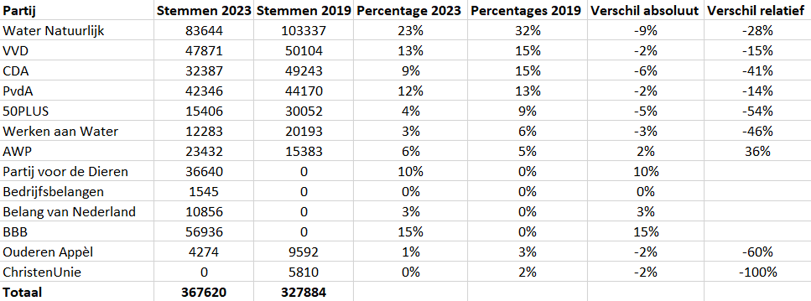

Kun je nu uitspraken doen over welke partij het meest heeft gewonnen en welke het meest verloren bij deze verkiezingen?

Cirkeldiagram invoegen
---------------------------------------

Ter afsluiting van deze opdracht maken we een cirkeldiagram bij de verkiezingsuitslagen van 2023. We gebruiken hiervoor kolom A en kolom D, zodat een diagram wordt gemaakt bij de percentages. Ga als volgt te werk:

* Selecteer de cellen A5 t/m A18.
* Houd de :kbd:`Ctrl`-toets ingedrukt en selecteer vervolgens cellen D5 t/m D18.
* Ga in de menubalk naar :guilabel:`Invoegen` en klik op het icoontje van het cirkeldiagram. Kies bij :guilabel:`2D-cirkel` de eerste optie.
  
Het cirkeldiagram wordt ingevoegd, maar ziet er nog niet heel mooi uit. Doe in elk geval het volgende:

* Selecteer het diagram en klik op het ➕ knopje dat rechtsboven het diagram verschijnt.
* De legenda staat momenteel onder het diagram. Verplaats hem naar rechts:

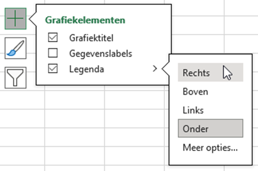

* Vink ook Gegevenslabels aan om de percentages in het diagram te tonen.
* Maak het diagramgebied wat groter zodat alle partijen in de legenda zichtbaar zijn.
* Verander de titel van het diagram in *Waterschapsverkiezingen 2023* en op de tweede regel in kleinere letters *Waterschap de Dommel*.
  
Als het goed is, heb je nu ongeveer het volgende diagram:

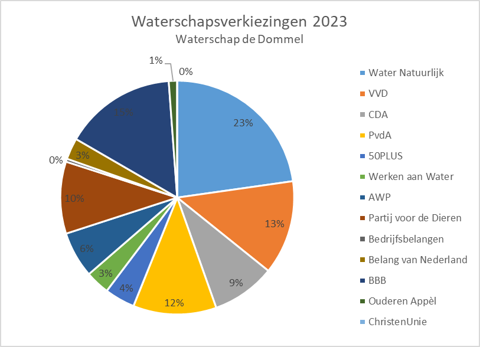

Uiteraard mag je het diagram naar eigen smaak verfraaien.

Dit is het einde van de laatste oefenopdracht. In het projectboekje vind je de eindopdracht die je samen met je groepje gaat maken.