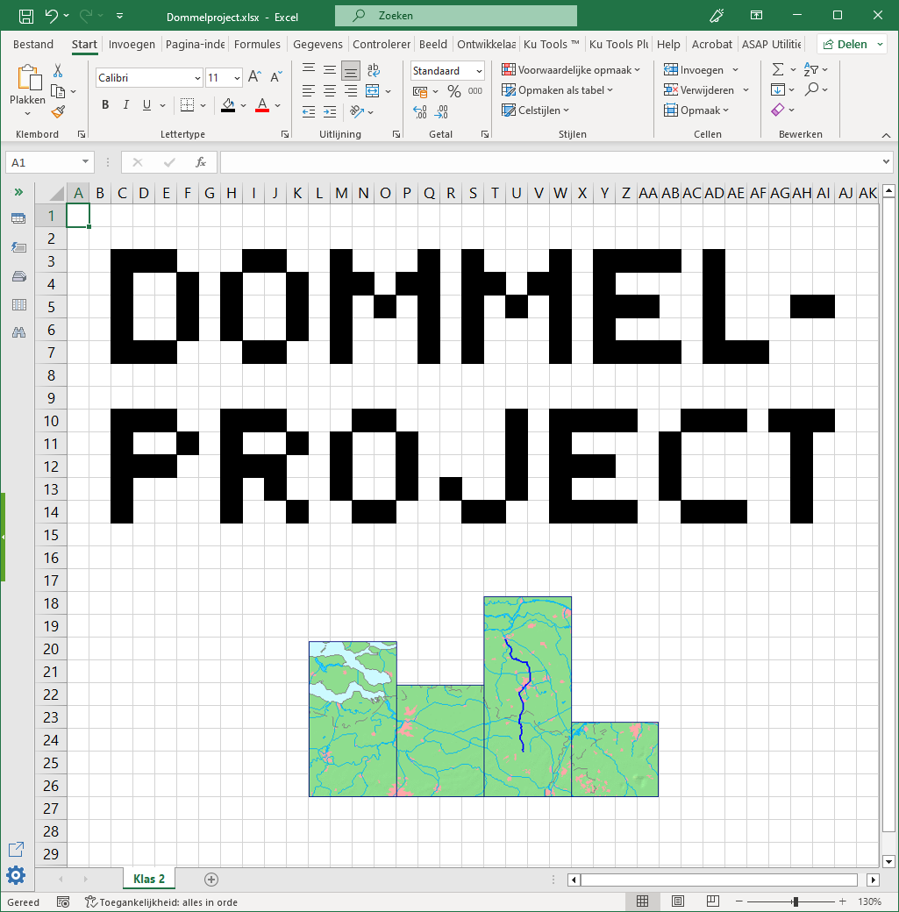

Werken met Excel
===================================

Bij het onderdeel wiskunde van het Dommelproject ga je aan de slag met Excel. Eerst leer je met behulp van vier oefenopdrachten de basis van Excel kennen. Daarna maak je een eindopdracht waarin je het geleerde toepast. Aan de oefenopdrachten werk je individueel; de eindopdracht maak je samen met je groepje.

De resultaten van de eindopdracht dienen te worden verwerkt in de Dommelprojectposter van je groepje.

Begin nu met het onderdeel Voorbereidingen.

.. toctree::
   :maxdepth: 2
   :caption: Inhoudsopgave:

   01_introduction/introduction
   02_basics/basics
   03_stroomsnelheid/stroomsnelheid
   04_kanoen/kanoen
   05_waterschapsverkiezingen/waterschapsverkiezingen
